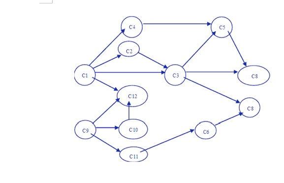

# toposort.c

拓扑排序

## 输入输出

### 输入

 * 图的顶点数
 * 邻接矩阵
 
### 输出

 * 顶点序号

## 参考资料

### 拓扑排序的基本思想

对于学生选修课程问题：顶点——表示课程；有向弧——表示先决条件，若课程i是j的先决条件，则图中有弧<i,j>。学生应按怎样的顺序学习这些课程，才能无矛盾、顺利地完成学业——拓扑排序。

AOV网——用顶点表示活动，用弧表示活动间优先关系的有向图称为顶点表示活动的网(Activity On Vertex network)，简称AOV网。若<vi,vj>是图中有向边，则vi是vj的直接前驱；vj是vi的直接后继；AOV网中不允许有回路，这意味着某项活动以自己为先决条件。

拓扑排序——把AOV网络中各顶点按照它们相互之间的优先关系排列成一个线性序列的过程叫拓扑排序。检测AOV网中是否存在环方法：

对有向图构造其顶点的拓扑有序序列，若网中所有顶点都在它的拓扑有序序列中，则该AOV网必定不存在环。

### 设计拓扑排序的步骤

1. 在有向图中选一个没有前驱的顶点且输出之；
2. 从图中删除该顶点和所有以它为尾的弧；
3. 重复上述两步，直至全部顶点均已输出；或者当图中不存在无前驱的顶点为止。

### 拓扑排序问题的特征

拓扑排序的有效性依赖于图本身所具有的两个重要性质：有向和无环。

1. 有向：任务之间有先后关系，即有方向。
2. 无环：若有环，回路中就会存在彼此矛盾的条件。

### 例子

编程实现，依次输出各个节点:

## 授权协议

This program is free software: you can redistribute it and/or modify it under the terms of the GNU General Public License as published by the Free Software Foundation, either version 3 of the License, or (at your option) any later version.

This program is distributed in the hope that it will be useful, but WITHOUT ANY WARRANTY; without even the implied warranty of MERCHANTABILITY or FITNESS FOR A PARTICULAR PURPOSE.  See the GNU General Public License for more details.

You should have received a copy of the GNU General Public License along with this program.  If not, see <http://www.gnu.org/licenses/>.

## 作者

 * [@Jamesits](https://github.com/Jamesits)
 * 徐之航